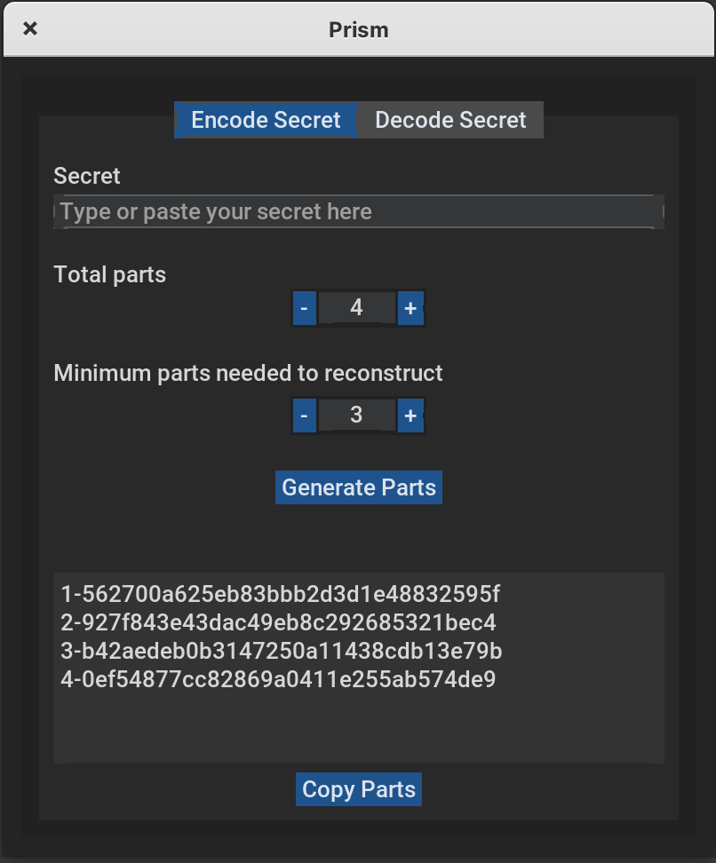

# Prism

Prism is a multi-platform GUI and CLI tool for splitting and reconstructing secrets using [Shamir's Secret Sharing](https://en.wikipedia.org/wiki/Shamir%27s_secret_sharing). It allows you to securely divide a secret (such as a password or recovery key) into multiple parts, requiring only a subset of those parts to reconstruct the original secret. This is useful for secure backup, key management, and sharing sensitive information among trusted parties.

## Features

- **Split secrets:** Divide a secret into _n_ parts, with a configurable threshold _k_ needed to reconstruct it.
- **Reconstruct secrets:** Combine any _k_ valid parts to recover the original secret.
- **User-friendly GUI:** Simple, cross-platform interface built with CustomTkinter.
- **Command-line interface (CLI):** Scriptable access for automation and integration.
- **Secure:** Uses PyCryptodome's implementation of Shamir's Secret Sharing.

<br>
<p align="center">
    
</p>

## Using the GUI

### Optiona A: use pre-built binaries
Find the latest releases [in the Releases section](https://github.com/dvilelaf/prism/releases).


### Option B: run the code directly
Install [Poetry](https://python-poetry.org/docs/#installing-with-the-official-installer) and run:

```bash
poetry shell
poetry install
python prism.py
```

## Using the CLI

Prism also provides a command-line interface for secret splitting and reconstruction.

### Split a secret

```bash
python cli.py split -k 3 -n 5 "my_secret"
```
- `-k`: Minimum number of parts required to reconstruct the secret.
- `-n`: Total number of parts to generate.
- `"my_secret"`: The secret to split.

### Reconstruct a secret

You can provide shares directly:

```bash
python cli.py combine -s 1-... 2-... 3-...
```

Or from a file (one share per line):

```bash
python cli.py combine -f shares.txt
```

## Packaging

To build a standalone executable:

```bash
make build
```